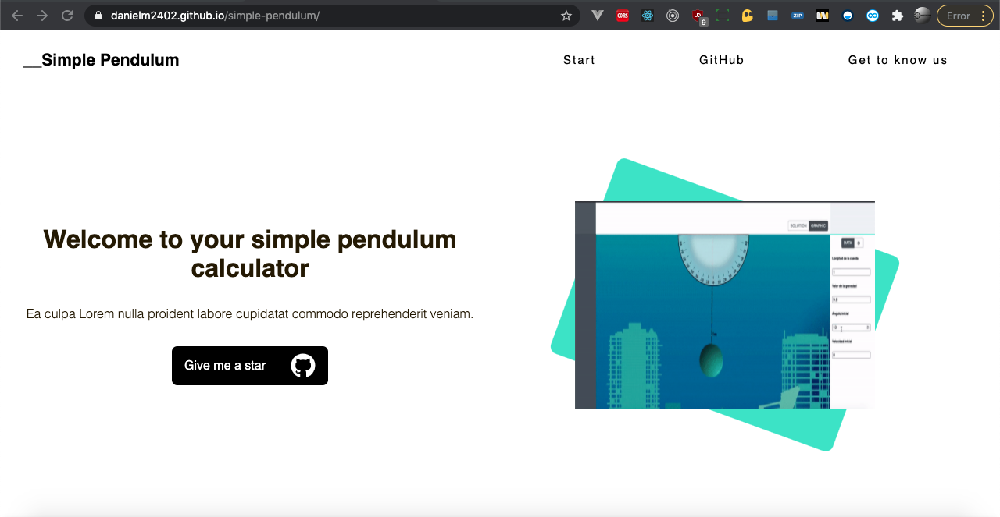

# [Non Responsive Simple pendulum calculator](https://danielm2402.github.io/simple-pendulum/)
Simple pendulum, forced pendulum and damped pendulum equations calculator
## [Try it yourself](https://danielm2402.github.io/simple-pendulum/)

## Features
* [ReactJS]
* [React-router]
* [Mathjax]
* [Function-plot]

## Install

Construction and testing of the project requires [node.js](http://nodejs.org/download/). `npm install -g npm@latest`.

Run project:

1. `npm run start`

## Screenshots

## Dedicatoria

_"Vivir en los corazones que dejamos atrás no es morir."_ _thomas campbell_

Este proyecto fue realizado para una de las materias más complicadas que he llevado al estudiar Ingeniería de Sistemas, y no lo hice solo, estuve acompañado de una gran persona... Tatiana Marcela Toquica, quien hoy, por cuestiones del destino, no está con nosotros. Recuerdo que siempre, al salir de clases, mencionaba que ganó esta materia gracias a este proyecto, y que como fui el desarrollador principal, fue gracias a mi. Yo solo me disponía a reír y a decirle que era trabajo en equipo. Hoy, días después de una triste despedida, y de lo que fue uno de los momentos más tristes de mi carrera y mi vida. Vengo a sellar esta despedida con esta pequeña dedicatoria... y debo decir que la historia fue al revés... Si yo pasé esta dificil materia fue gracias a ella, quien fue capaz de entender cada una de las formulas que hacen posibles funcionar este proyecto, era capaz de entender aquellas clases que para mi eran bastante tortuosas y abstraer todo lo necesario como si de un simple juego se tratara. Sin duda alguna no solo yo perdí una gran compañera y amiga, el mundo perdió una gran profesional y una persona excepcional. 

_A honor de Tatiana Marcela Toquica Perdomo_

